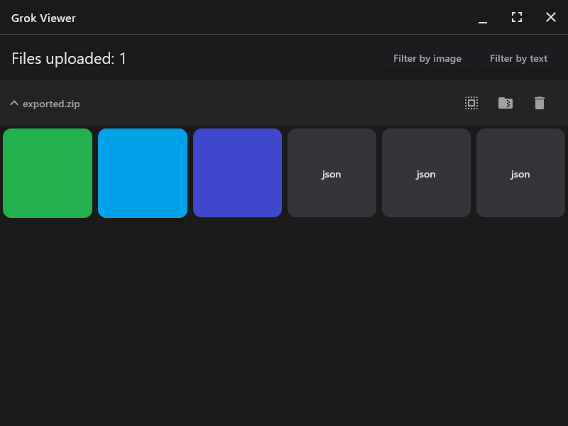

<h1 align="center">Grok Viewer</h1>

<p align="center">An application for viewing, filtering, and exporting binary data from Grok AI (xAI) archives into human-readable
formats</p>

<p align="center"></p>

> [!NOTE]
> The application was designed using the [Reduce & Conquer](https://github.com/numq/reduce-and-conquer) architectural
> pattern

## Installation

GrokViewer is distributed as a portable application. No installation is required.

1. Navigate to the [Releases](https://github.com/numq/grok-viewer/releases) page.

2. Download the archive for your operating system:

    - Windows: `grok-viewer-win-x64.zip`

    - macOS: `grok-viewer-mac-x64.zip`

    - Linux: `grok-viewer-linux-x64.tar.gz`

3. Extract the archive and run the executable file found inside the `app` folder.

## Build

To build the distributable binaries locally, ensure you have JDK 17+ and run:

```bash
./gradlew :desktop:createDistributable
```

___

<p align="center">
  <a href="https://numq.github.io/support">
    
  </a>
  <br>
  <a href="https://numq.github.io/support" style="text-decoration: none;">
    <code><font color="#bb9af7">numq.github.io/support</font></code>
  </a>
</p>